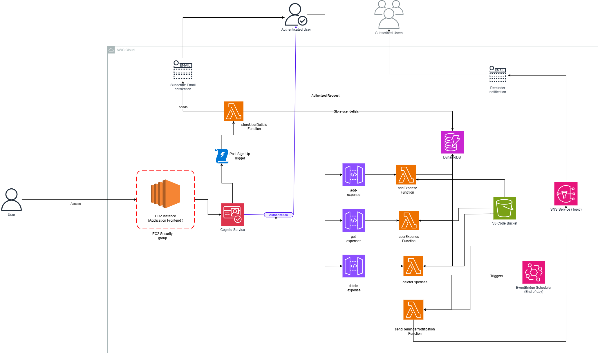

# Expense Enforcer

Expense Enforcer is a robust and scalable web application designed to help users manage their daily expenses efficiently. This application offers features like logging expenses, categorizing them, setting spending limits, and viewing spending patterns. Built with a serverless architecture on AWS, the application ensures high availability, security, and cost efficiency.

## **Table of Contents**
- [Project Overview](#project-overview)
- [Features](#features)
- [Technology Stack](#technology-stack)
- [Infrastructure as Code (IaC)](#infrastructure-as-code-iac)
- [Architecture](#architecture)
- [Setup and Deployment](#setup-and-deployment)
- [Future Enhancements](#future-enhancements)
- [License](#license)

---

## **Project Overview**
Expense Enforcer is designed to simplify personal finance management for:
- **Students** to manage limited budgets.
- **Professionals** to track discretionary spending.
- **Families** to ensure adherence to household budgets.

The application integrates key AWS services to deliver a secure, scalable, and user-friendly experience.

---

## **Features**
- **User-Friendly Interface**: Simple and intuitive UI for expense logging.
- **Expense Categorization**: Organize expenses by type for better insights.
- **Notifications**: Daily reminders to log expenses.
- **Budget Management**: Set spending limits and get alerts when approaching or exceeding them.
- **Data Security**: Secure user authentication and data encryption.
- **Quick Deployment**: Infrastructure as Code ensures the entire architecture can be deployed in minutes.

---

## **Technology Stack**
### **Frontend**
- **Next.js**: Hosted on AWS EC2 for a responsive web interface.

### **Backend**
- **AWS Lambda**: Serverless functions for business logic.
- **AWS API Gateway**: Secure API management.
- **AWS DynamoDB**: Fast and scalable NoSQL database for storing user and expense data.

### **Additional Services**
- **AWS Cognito**: Secure user authentication and authorization.
- **AWS S3**: Object storage for application assets and potential user-uploaded files.
- **AWS SNS & EventBridge**: Notification system for user reminders.
- **AWS KMS**: Key management for encryption and data security.

---

## **Infrastructure as Code (IaC)**
The entire AWS architecture for Expense Enforcer is defined as Infrastructure as Code (IaC) using **AWS CloudFormation**. This allows the complete deployment of the backend services, frontend hosting environment, and necessary configurations within **a few minutes**.

### **Benefits of IaC:**
1. **Rapid Deployment**: Fully automated setup of AWS resources.
2. **Consistency**: Ensures that the deployed infrastructure matches the defined architecture every time.
3. **Ease of Maintenance**: Update or roll back configurations with minimal effort.
4. **Scalability**: Simplifies scaling resources for growing demands.

To deploy, simply use the provided CloudFormation template:
```bash
aws cloudformation deploy --template-file template.yaml --stack-name ExpenseEnforcerStack
```

---

## **Architecture**
The architecture leverages a fully serverless design for efficiency and scalability.

### **High-Level Components**
1. **Frontend**: Next.js hosted on AWS EC2.
2. **Authentication**: Managed with AWS Cognito.
3. **API Gateway**: Routes user requests to backend services.
4. **Backend Logic**: AWS Lambda handles business operations.
5. **Storage**: DynamoDB for structured data storage.
6. **Notifications**: SNS and EventBridge for real-time user updates.

### **Architecture Diagram**

---

## **Setup and Deployment**
### **Prerequisites**
- AWS CLI installed and configured with appropriate permissions.
- Node.js and npm installed.

### **Steps**
1. Clone the repository:
   ```bash
   git clone <repository-url>
   cd Expense-Enforcer
   ```
2. Deploy the AWS infrastructure using CloudFormation:
   ```bash
   aws cloudformation deploy --template-file template.yaml --stack-name ExpenseEnforcerStack
   ```
3. Install frontend dependencies:
   ```bash
   npm install
   ```
4. Start the application:
   ```bash
   npm start
   ```

---

## **Future Enhancements**
1. **Advanced Security**: Add multi-factor authentication.
2. **Improved Performance**: Implement caching with AWS CloudFront.
3. **Expense Reports**: Generate and email detailed monthly reports.
4. **Forecasting**: Use Amazon Forecast to predict future expenses.
5. **Integration with CI/CD**: Automate deployments using AWS CodePipeline.

